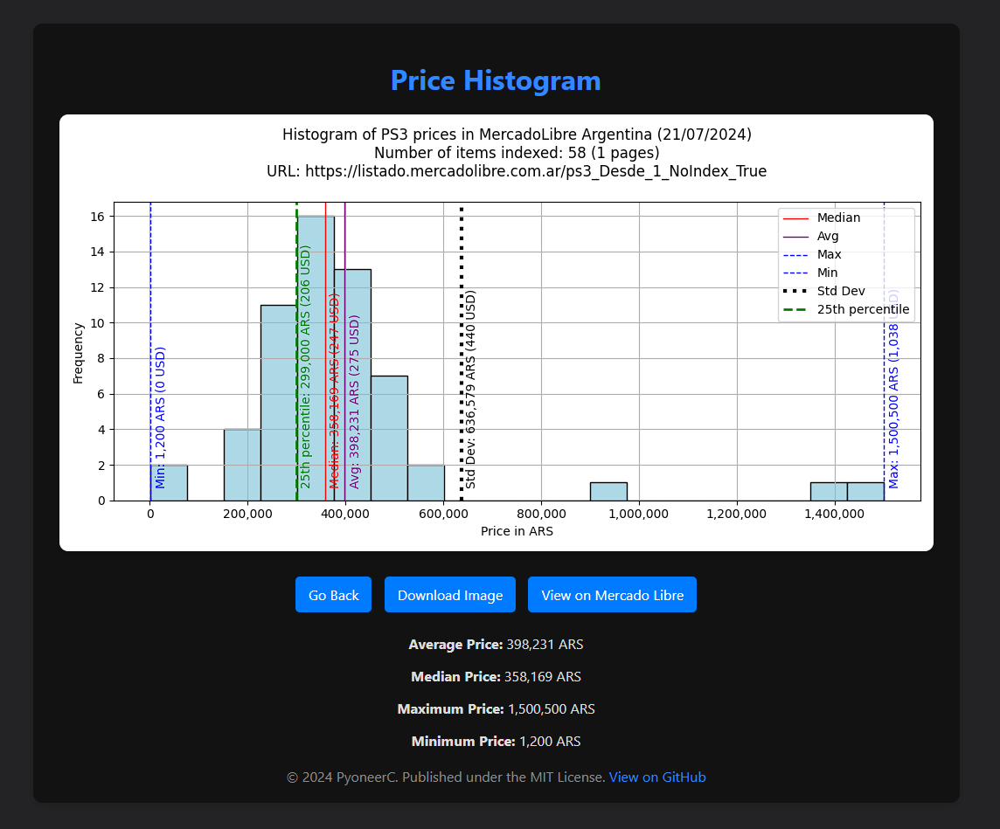
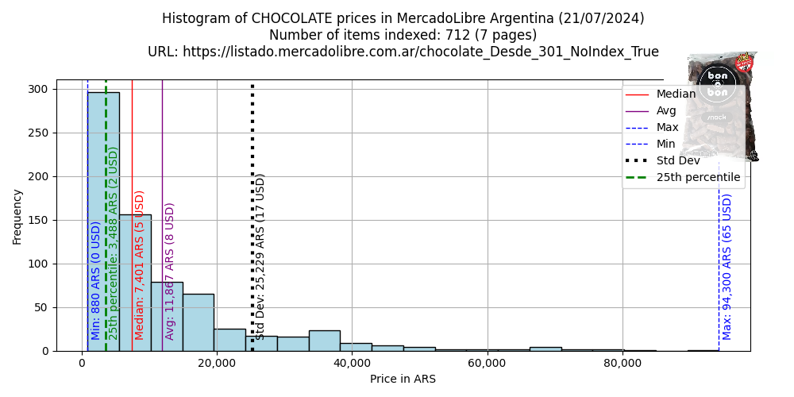
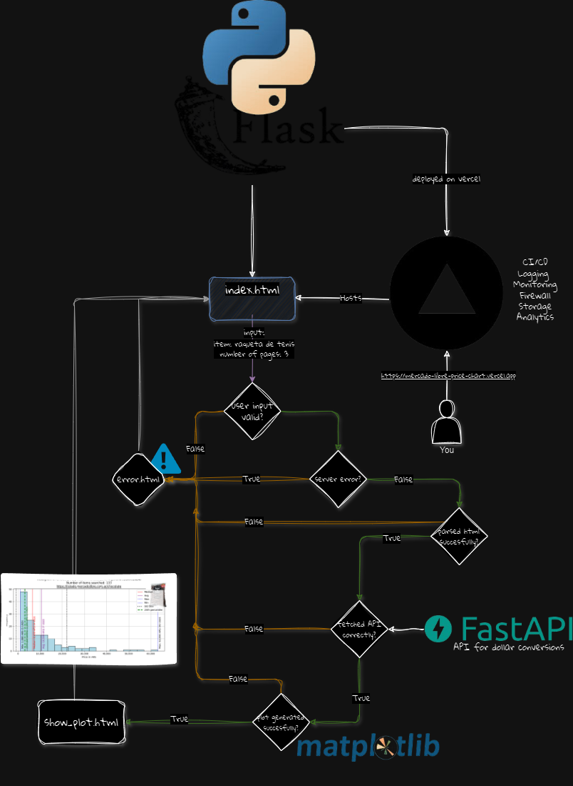

# MercadoLibre Price Chart

## Descripción

Este proyecto es una aplicación web desarrollada en Flask que permite consultar precios de productos en MercadoLibre y visualizarlos en un histograma. Utiliza web scraping para obtener los precios, la API [monedas-api](https://github.com/pyoneerC/monedas-api) (desarrollada por mí) para el tipo de cambio actualizado a dólares, y Matplotlib para generar gráficos claros y concisos que representan eficazmente la variabilidad de los precios.

> [!NOTE]
> [Disponible en todos los navegadores web!](mercado-libre-price-chart.vercel.app)




> [!TIP]
> Puedes ingresar cualquier artículo que desees en la barra de búsqueda!

## Funcionalidades

- **Consulta de Precios**: Permite al usuario ingresar el nombre de un producto y el número de páginas para consultar en MercadoLibre.
- **Generación de Gráfico**: Visualiza un histograma de los precios obtenidos, mostrando estadísticas relevantes como el promedio, la mediana, el máximo, el mínimo, y la desviación estándar.
- **Visualización de Imágenes**: Incluye una imagen representativa del primer resultado de la búsqueda en el gráfico.
- **Interfaz de Usuario**: Ofrece una interfaz simple para introducir los parámetros de búsqueda y mostrar los resultados.

> [!TIP]
> Puedes descargar la imagen del gráfico y guardarla haciendo click en el botón "Download Image".

## Instalación

Para ejecutar este proyecto en tu máquina local, sigue estos pasos:

1. **Clonar el Repositorio**:
   ```bash
   git clone https://github.com/tu_usuario/mercado-libre-price-chart.git
    ```
   
2. **Instalar Dependencias**:

Asegúrate de tener Python y pip instalados en tu sistema. Luego, instala las dependencias del proyecto con el siguiente comando:
   ```bash
   pip install -r requirements.txt
   ```

3. **Configurar Variables de Entorno**:

Crea un archivo `.env` en el directorio raíz del proyecto y agrega las siguientes variables:
   ```env
   FLASK_APP=app.py
   FLASK_ENV=development
   FLASK_DEBUG=0
   ```

4. **Ejecutar la Aplicación**:

Finalmente, ejecuta la aplicación con el siguiente comando:
   ```bash
   flask run
   ```

La aplicación estará disponible en `http://127.0.0.1:5000`

> [!WARNING]
> Cuidado con ingresar un número muy alto de páginas, ya que la operación puede tardar varios segundos en completarse.


> [!CAUTION]
> Intenta ser lo más específico posible en tu búsqueda para obtener resultados más precisos. Puedes ver de donde se obtienen los datos clickeando el botón que dice "View on MercadoLibre".




## Tecnologías Utilizadas

- **Flask**: Framework web para Python.
- **Matplotlib**: Librería para la creación de gráficos.
- **BeautifulSoup**: Biblioteca para el análisis de HTML y extracción de datos.
- **Requests**: Biblioteca para hacer solicitudes HTTP.
- **NumPy**: Biblioteca para el cálculo numérico en Python.

## Diagrama de Flujo



## Contribuciones

Este proyecto es de código abierto y las contribuciones son bienvenidas. 

## Licencia

Este proyecto está licenciado bajo la licencia MIT. Para más información, consulta el archivo [LICENSE](LICENSE).