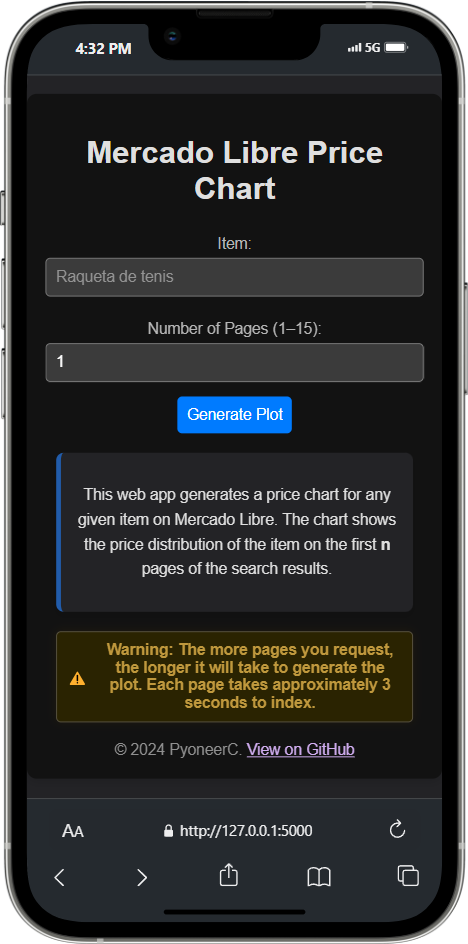

# Mercadix: Price Analysis for Mercado Libre


## What is Mercadix?

Mercadix helps you quickly understand the price landscape for any product on Mercado Libre (Argentina & Brasil). Simply search for an item, and Mercadix generates a clear histogram showing the range of prices currently listed. This allows you to see the minimum, maximum, average, and median prices at a glance, helping you make informed decisions.

**No technical knowledge required!** Just type what you're looking for.

> [!NOTE]  
> [Try it now! Available in all modern browsers!](https://mercado-libre-price-chart.vercel.app)

  


## Who is this for?

Mercadix is useful for:

*   **Small Business Owners & Retailers:** Quickly check competitor pricing or understand the market value of products you sell or plan to sell.
*   **Resellers:** Identify potentially underpriced items or gauge the typical selling price for products you want to flip.
*   **Informed Consumers:** See if a listed price is a good deal compared to the rest of the market before you buy.
*   **Anyone curious about pricing trends** on Mercado Libre.

> [!TIP]  
> Want to know the price range for "Smart TV 50 pulgadas"? Just search it!



## Key Features

*   **Easy Price Lookup:** Enter the product name you want to analyze.
*   **Clear Visualizations:** Get an easy-to-understand histogram of prices.
*   **Key Price Stats:** Instantly see the average, median, highest, and lowest prices, plus the price variation (standard deviation).
*   **Product Image:** See a sample image from the search results.
*   **Simple Interface:** Designed for ease of use, no complex setup needed.

> [!TIP]  
> You can download the generated price graph image by clicking the "Download Image" button.

## How it Works (Simplified)

Mercadix searches Mercado Libre for the product you entered, collects the prices from the listings, and then uses statistical analysis and graphing tools (like Matplotlib) to create the visual price summary. It also uses the [monedas-api](https://github.com/pyoneerC/monedas-api) for optional currency conversion insights (though the primary display is in local currency).

## Installation (For Developers)

To run this project on your local machine, follow these steps:

1. **Clone the Repository**:
```bash
git clone https://github.com/tu_usuario/mercado-libre-price-chart.git
```
   
2. **Install Dependencies**:

Make sure you have Python and `pip` installed on your system. Then, install the project dependencies with the following command:
   ```bash
   pip install -r requirements.txt
   ```

3. **Set Up Environment Variables**:

Create a `.env` file in the root directory of the project and add the following variables:
   ```env
   FLASK_APP=app.py
   FLASK_ENV=development
   FLASK_DEBUG=0
   ```

4. **Run the Application**:

Finally, run the application with the following command:
   ```bash
   flask run
   ```

The application will be available at `http://127.0.0.1:5000`

> [!WARNING]  
> Be cautious when requesting a high number of pages — the operation may take several seconds to complete.

> [!CAUTION]  
> Try to be as specific as possible with your search to get more accurate results. You can check the data source by clicking the **"View on MercadoLibre"** button.


## Running Tests (For Developers)

### Backend Tests
To run backend tests, use the following command:
```
pytest tests/backend
```

### Frontend Tests
To run frontend tests, use the following command:
```
npm test
```

### End-to-End Tests
To run E2E tests, use the following command:
```
npx playwright test
```

## Technologies Used (For Developers)

- **Flask**: Web framework for Python.
- **Matplotlib**: Library for creating visualizations.
- **BeautifulSoup**: Library for parsing HTML and extracting data.
- **Requests**: HTTP library for sending and receiving data.
- **NumPy**: Library for numerical computing in Python.

## Flow Diagram (Technical)


## Contributions

This is an open-source project, and contributions are welcome!

## License

This project is licensed under the **MIT License**. For more information, see the [LICENSE](LICENSE) file.